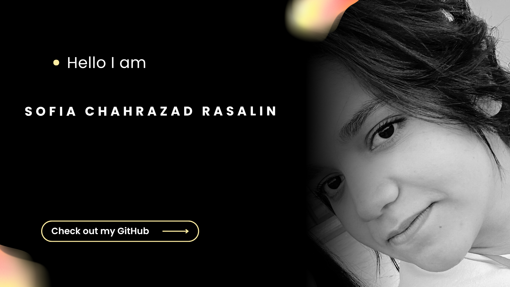

  
🇫🇷 Version Française

  

  ## À propos de moi
  * Étudiante en informatique à l’Université Paris-Saclay.  
  * Me contacter : **raslain.sofia@gmail.com** ou via ces liens sociaux :

  ### Liens supplémentaires
  

  
  
  

  ### Stack technologique
  

  
  
  

  ### Quelques statistiques
  <table style="border-collapse: collapse; border: 1px solid #A1CDF2;">
    <tr>
      <td align="center" style="padding: 10px; border: 1px solid #A1CDF2;">
      </td>
      <td align="center" style="padding: 10px; border: 1px solid #A1CDF2;">

      </td>
    </tr>
  </table>

---

  
🇬🇧 English Version

  

  ## About Me
  * Computer science major at Paris-Saclay University.  
  * Reach out to me: **raslain.sofia@gmail.com** or use these social links:

  ### Extra Links
  

  
  
  

  ### Tech Stack

  
  
  

  ### Some Statistics
  <table style="border-collapse: collapse; border: 1px solid #A1CDF2;">
    <tr>
      <td align="center" style="padding: 10px; border: 1px solid #A1CDF2;">
        
      </td>
      <td align="center" style="padding: 10px; border: 1px solid #A1CDF2;">

      </td>
    </tr>
  </table>

